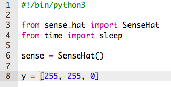
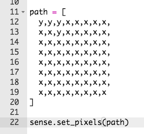

## ارسم مسار

دعنا أولاً نرسم المسار الذي يجب أن تتبعه شخصيتك.

+ افتح مشروع حبل البهلوان مشروع البداية بالTrinket: <a href="http://jumpto.cc/tightrope-go" target="_blank">jumpto.cc/tightrope-go</a>.
    
    **تم اعداد التعليمات البرمجية لإعداد Sense HAT لك.**

+ لنبدأ بإنشاء متغيرات لتخزين الألوان التي تريد استخدامها. تذكر أنه لتعيين لون للضوء الواحد، يجب أن تقول كم يجب أن يكون لديه اللون الأحمر والأخضر والأزرق.
    
    لإنشاء اللون الأصفر ، ستحتاج إلى الحد الأقصى باللون الأحمر والأخضر ، ولا يوجد أزرق:
    
    
    
    (إذا كنت تفضل ذلك ، يمكنك الانتقال إلى [ jumpto.cc/colours ](http://jumpto.cc/colours) واختر أي لون يعجبك!

+ ستحتاج أيضًا إلى وحدات بكسل سوداء (أو أي لون تريده) حول المسار.
    
    

+ لرسم المسار الخاص بك ، تحتاج أولاً إلى إنشاء قائمة تحتوي على لون كل بكسل.
    
    
    
    **لتقليل الكتابة، يمكنك نسخ قوس قزح من ` snippetets.py ` في مشروعك.**
    
    

+ بعد ذلك ، تحتاج إلى استدعاء ` set_pixels ` لعرض صورة مسارك على Sense HAT.
    
    

+ انقر فوق 'تشغيل' لاختبار الكود الخاص بك. يجب أن ترى بكسل أصفر في الأماكن التي استخدمت المتغير `y` ، ولايوجد لون في الأماكن التي استخدمتها `x`.
    
    