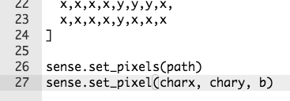

## ارسم لاعبك

دعنا نضيف الشخصية إلى لعبتك.

+ أولا، إنشاء متغير لون آخر للشخصية الخاصة بك. إليك كيفية إنشاء اللون الأزرق:
    
    

+ بعد ذلك تحتاج إلى إنشاء متغيرات لتخزين شخصيتك x و y المكان. للبدء، سنقوم بتعيين كل من هذين إلى `0`، وهو أعلى اليسار في لوحة Sense HAT.
    
    

+ لعرض شخصيتك، استخدم `set_pixel`. تحتاج إلى إخبار `set_pixel` الموضع x و y من البكسل لتعيينه، وكذلك اللون.
    
    

+ اختبر الكود البرمجي الخاص بك، ويجب أن ترى شخصيتك في أعلى اليسار من الشاشة.
    
    