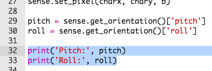
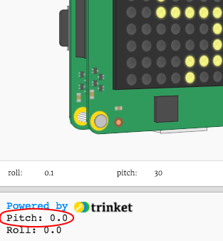

## لفة، اعلى اسفل وانحراف

سوف تميل "Sense HAT" لتحريك شخصيتك. دعونا نبدأ بالعثور على **التوجيه** (المكان) الخاص بـ Sense HAT.

+ يمكن لـ Sense HAT أن يكتشف **roll**، و**pitch** و**yaw**.
    
    

+ حاول سحب Sense HAT لتغيير قيم اللف ، والخطوة والانحراف لترى كيف تتحرك.
    
    
    
    **اضغط على زر إعادة التعيين لإعادة وضع Sense HAT إلى موضع البداية عند الانتهاء من الاختبار.**

+ نحتاج فقط إلى العرض التقديمي ولفة هذا المشروع ، لذا أضف سطرين من التعليمات البرمجية للحصول على هذه القيم من Sense HAT.
    
    

+ اطبع الحزمة و قم بالتشغيل لاختبارها.
    
    

+ قم بتشغيل الكود الخاص بك لاختباره ، وقم بتغيير درجة Sense HAT لإمالته إلى اليمين. ستلاحظ أن القيمة المطبوعة `pitch` لا تتغير!
    
    

+ المشكلة هي أنك فقط تحصل على `pitch` و `درج` و **مرة واحدة**.
    
    للقيام بذلك مرارا وتكرارا، ستحتاج أولا إلى وضع كل التعليمات البرمجية الخاصة بك لتعيين وحدات البكسل، بالإضافة إلى الحصول على قيم `pitch` و `roll` وطباعتها.
    
    

+ يمكنك بعد ذلك إضافة `while True:` فوق الرمز المحدد لتشغيله إلى الأبد.
    
    

+ اختبر تعليماتك البرمجية مرة أخرى، وهذه المرة يجب أن ترى قيمة مطبوعة`pitch`.
    
    