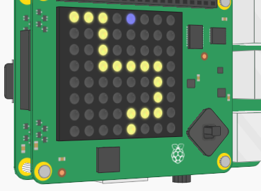
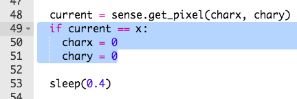

## العودة إلى البداية

دعنا نعيد الشخصية إلى البداية عندما تسقط عن المسار.

+ ربما كنت قد لاحظت أن لا شيء يحدث عندما تسقط الشخصية عن المسار.
    
    

+ لإصلاح هذا، سنقوم بإرسال الشخصية مرة أخرى إلى البداية إذا كانوا يقفون على البكسل الأسود.
    
    دعنا نبدأ بالحصول على لون البكسل الذي انتقلت إليه الشخصية.
    
    

+ إذا كان لون البكسل الحالي أسود، فأرسل الشخصية مرة أخرى إلى البداية.
    
    

+ اختبر التعليمات البرمجية الخاصة بك ويجب أن ترى الشخصية تتحرك مرة أخرى إلى البداية إذا سقطوا على الطريق.