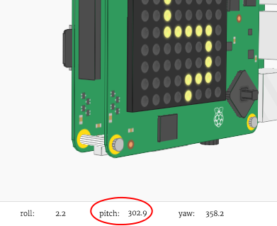

--- challenge ---
## Challenge: Create your own path
Can you edit your `path` variable to create a path to follow?

__Make sure that your path starts at the top-left of the display.__

## Step 2: Draw your player

Let's add the character to your game.

+ First, create another colour variable for your character. Here's how to create blue:

	

+ Next you need to create variables to store your character's x and y position. To start with, we'll set these both to `0`, which is the top-left of the Sense HAT.

	

+ To display your character, use `set_pixel`. You need to tell `set_pixel` the x and y position of the pixel to set, as well as the colour.

	

+ Test your code, and you should now see your character in the top-left of the screen.

	

## Step 3: Roll, pitch and yaw

You'll be tilting the Sense HAT to move your character. Let's start by finding out the __orientation__ (the position) of your Sense HAT.

+  The Sense HAT can detect its __roll__, __pitch__ and __yaw__.

	

+ Try dragging the Sense HAT to change its roll, pitch and yaw values to see how it moves.

	

	__Press the reset button to put the Sense HAT back to the starting position when you've finished testing.__

+ We only need the pitch and the roll for this project, so add 2 lines of code to get these values from the Sense HAT.

	

+ Print the pitch and roll to test them out.

	

+ Run your code to test it, and change the pitch of the Sense HAT to tilt it to the right. You'll notice that the printed `pitch` value doesn't change!

	

+ The problem is that you are only getting and printing the `pitch` and `roll` __once__.

	To do this repeatedly, you'll first need to indent all of your code for setting the pixels, as well as getting and printing the `pitch` and `roll` values.

	

+ You can then add `while True:` above the indented code to run it forever.

	

+ Test your code again, and this time you should see the printed `pitch` value change.

	

## Step 4: Moving the character

Now let's move your character when the Sense HAT is tilted.

+ Let's move your character to the right if the Sense HAT's `pitch` is between `270` and `315` degrees.

	

+ Add this code to change the character's x position if the pitch is between `270` and `315`:

	

	__Make sure that this code is indented, so that the character moves repeatedly if the Sense HAT is tilted.__

+ Tilt your Sense HAT so that the `pitch` is between `270` and `315` degrees. You should see that your character moves to the right, but keeps going off the display!

	

	You will also see an error, because the character's x position goes above 7, which is not a valid position on the display.

	

+ To fix this, you only want to move your character to the right if its current position is less than 7.

	

+ Test your improved code, and you should now see that your character moves __until it gets to the right side of the display__.

	

+ We also want to move your character to the left when the `pitch` is between `45` and `90` degrees.

	

+ Add this code to move your character to the left if the `pitch` is between `45` and `90`, but __only if the character isn't already at the far left of the display__.

	

+ Test your code to make sure that you can tilt your character back to the left.

+ Next, let's add code to change your character's __y-position__, moving it down when the __`roll`__ value is between `45` and `90`.

	

+ test this code to see if you can tilt the Sense HAT to move your character down.

	

+ If you want to slow your game down, you can add short `sleep` at the end of your `while True:` loop.

	

--- /challenge ---### Additional information for club leaders

If you need to print this project, please use the [Printer friendly version](./print).

--- collapse ---
---
title: Club leader notes
---

## Introduction:
In this project, children will learn about the Sense HAT orientation sensor by creating a line-follownig game. The player tilts the Sense HAT to move the character along a path. Deviating from the path sends the player back to the start! 

## Online Resources

__This project uses Python 3.__ We recommend using [Trinket](https://trinket.io/) to write Python online. This project contains the following Trinkets:

+ ['Tightrope' Starter Trinket -- jumpto.cc/tightrope-go](http://jumpto.cc/tightrope-go)

There is also a trinket containing the completed project:

+ [‘Tightrope’ Finished -- trinket.io/python/790adaa749](https://trinket.io/python/790adaa749)

## Offline Resources
This project can also be [completed offline](https://www.codeclubprojects.org/en-GB/resources/physical-sense-hat/) on a Raspberry Pi computer with a Sense HAT. You can access the project resources by clicking the 'Project Materials' link for this project. This link contains a 'Project Resources' section, which includes resources that children will need to complete this project offline. Make sure that each child has access to a copy of these resources. This section includes the following files:

+ tightrope/main.py
+ tightrope/snippets.py

You can also find a completed version of this project in the 'Volunteer Resources' section, which contains:

+ tightrope-finished/main.py
+ tightrope-finished/snippets.py

(All of the resources above are also downloadable as project and volunteer `.zip` files.)

## Learning Objectives
+ Sense HAT orientation (roll, pitch and yaw);
+ Sense HAT display;
+ RGB colours;

This project covers elements from the following strands of the [Raspberry Pi Digital Making Curriculum](http://rpf.io/curriculum):

+ [Combine programming constructs to solve a problem.](https://www.raspberrypi.org/curriculum/programming/builder)

## Challenges
+ "Create your own path" - creating a image using a list of pixels;
+ "Moving up!" - moving the character up in response to changing `roll` values.
+ "Changing the difficulty" - testing the finished game and making changes based on player feedback.

--- /collapse ---

--- collapse ---
---
title: Project materials
---
## Project resources
* [.zip file containing all project resources](resources/tightrope-project-resources.zip)
* [Tightrope starter project](http://jumpto.cc/tightrope-go)
* [Offline starter Python file](resources/tightrope-main.py)
* [Offline Python file containing useful code](resources/tightrope-snippets.py)

## Club leader resources
* [.zip file containing all completed project resources](resources/tightrope-volunteer-resources.zip)
* [Online completed Trinket Tightrope project](https://trinket.io/python/790adaa749)
* [tightrope-finished/main.py](resources/tightrope-finished-main.py)
* [tightrope-finished/snippets.py](resources/tightrope-finished-snippets.py)

--- /collapse ---