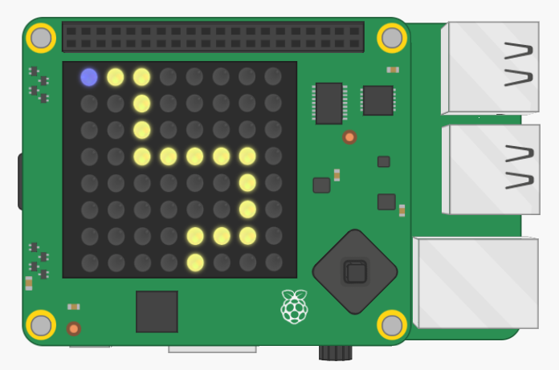

## Introducción

En este proyecto crearás un juego donde debes inclinar tu Sense HAT para guiar a tu personaje a lo largo del camino. Si caes fuera del camino, ¡tendrás que iniciar desde el principio!

  <iframe src="https://trinket.io/embed/python/790adaa749?outputOnly=true&start=result" width="600" height="500" frameborder="0" marginwidth="0" marginheight="0" allowfullscreen mark="crwd-mark">
</iframe> 

### Información adicional para los líderes del club

Si necesitas imprimir este proyecto, usa la [versión para imprimir](https://projects.raspberrypi.org/es-LA/projects/tightrope/print).

--- collapse ---
---
title: Notas para el líder del club
---

## Introducción:

En este proyecto, los niños aprenderán acerca de la orientación del sensor del Sense HAT para crear un juego de seguimiento de línea. El jugador inclina el Sense HAT para mover el personaje a lo largo del camino. ¡Desviarse del camino envía al jugador de regreso al inicio!

## Recursos en línea

**Este proyecto usa Python 3.** Recomendamos usar [Trinket](https://trinket.io/) para escribir Python online. Este proyecto contiene los siguientes enlaces de Trinket:

* ['Cuerda floja' Starter Trinket -- jumpto.cc/tightrope-go](http://jumpto.cc/tightrope-go)

También hay un enlace de Trinket que contiene el proyecto completo:

* [‘Cuerda floja’ Finished -- trinket.io/python/f87fe7288f](https://trinket.io/python/f87fe7288f)

## Recursos sin conexión

Este proyecto también se puede [completar sin conexión](https://www.codeclubprojects.org/en-GB/resources/physical-sense-hat/) en una computadora Raspberry Pi con un Sense HAT. Puedes acceder a los recursos del proyecto haciendo click en el enlace "Materiales del proyecto" para este proyecto. Este enlace contiene una sección de 'Recursos del proyecto', que incluye recursos que los niños necesitarán para completar este proyecto sin conexión. Asegúrate de que cada niño tenga acceso a una copia de estos recursos. Esta sección incluye los siguientes archivos:

* tightrope/main.py
* tightrope/snippets.py

Además, puedes encontrar una versión completa de este proyecto en la sección 'Recursos para Voluntarios', que contiene:

* tightrope-finished/main.py
* tightrope-finished/snippets.py

(Todos los recursos anteriores también se pueden descargar como archivos `.zip` de proyectos y voluntarios.)

## Objetivos de Aprendizaje

* Orientación Sense HAT (cabeceo, alabeo, guiñada);
* Pantalla del Sense HAT;
* Colores RGB;

Este proyecto incluye elementos con los siguientes aspectos del [Currículo de Creación Digital de Raspberry Pi](http://rpf.io/curriculum):

* [Combina estructuras de programación para resolver un problema.](https://www.raspberrypi.org/curriculum/programming/builder)

## Desafíos

* "Crea tu propia ruta": crea una imagen usando una lista de píxeles;
* "¡Avanza!" - mueve el personaje en respuesta al cambio de los valores `roll`.
* "Cambiar la dificultad": prueba el juego terminado y haz cambios basados en los comentarios de los jugadores.

--- /collapse ---

--- collapse ---

## Materiales del proyecto

## Recursos del proyecto

* [Archivo.zip contiene todos los recursos del proyecto](resources/tightrope-project-resources.zip)
* [Proyecto inicial 'Cuerda floja'](http://jumpto.cc/tightrope-go)
* [Archivo de Python inicial sin conexión](resources/tightrope-main.py)
* [Archivo de Python sin conexión que contiene código útil](resources/tightrope-snippets.py)

## Recursos para el líder del club

* [Archivo .zip que contiene todos los recursos del proyecto terminado](resources/tightrope-volunteer-resources.zip)
* [Proyecto Trinket "Cuerda floja" completado en línea](https://trinket.io/python/f87fe7288f)
* [tightrope-finished/main.py](resources/tightrope-finished-main.py)
* [tightrope-finished/snippets.py](resources/tightrope-finished-snippets.py)

--- /collapse ---