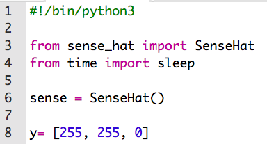
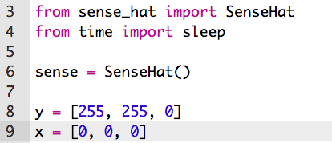
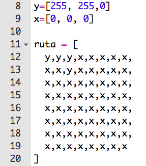
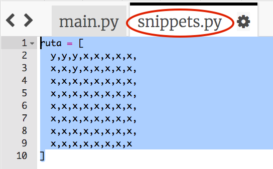
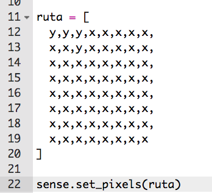
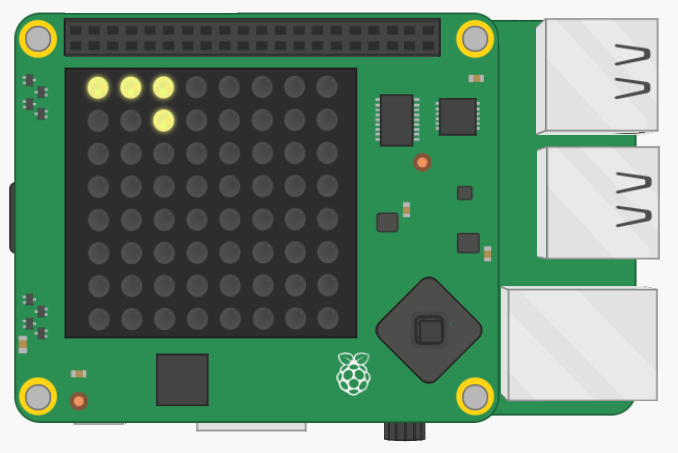

## Dibuja una ruta

Primero, dibujemos el camino que tu personaje debe seguir.

+ Abre el Trinket inicial de "Cuerda Floja": <a href="http://jumpto.cc/tightrope-go" target="_blank"> jumpto.cc/tightrope-go </a>.
    
    **El código para configurar el Sense HAT ha sido incluido para ti.**

+ Empecemos por crear variables para almacenar los colores que quieres usar. Recuerda que para ajustar el color de un LED individual, necesitas decir cuánto rojo, verde y azul debe tener.
    
    Para crear amarillos, necesitarás el máximo del rojo y verde, sin azul:
    
    
    
    (Si lo prefieres, puedes ir a [jumpto.cc/colours](http://jumpto.cc/colours) ¡y elegir cualquier color que quieras!)

+ También necesitarás píxeles negros (o cualquier color que quieras) alrededor de la ruta.
    
    

+ Para dibujar la ruta, primero necesitas crear una lista que contenga el color de cada píxel.
    
    
    
    **Para ahorrarte el tipeado, puedes copiar el código de `snippets.py` en tu proyecto.**
    
    

+ A continuación, necesitas llamar a `set_pixels` para mostrar tu imagen de ruta en el Sense HAT.
    
    

+ Haz click en 'ejecutar' para probar tu proyecto. Deberías ver un píxel amarillo en los lugares que has usado tu variable `y`, y ningún color en los lugares que has usado `x`.
    
    