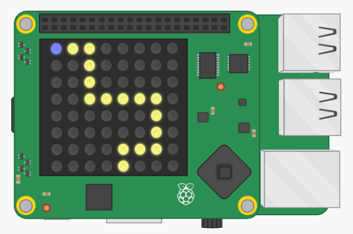

## Dibuja a tu jugador

Vamos a añadir el personaje a tu juego.

+ Primero, crea otra variable de color para tu personaje. Así es como se crearía el azul:
    
    

+ A continuación necesitas crear variables para almacenar la posición x e y de tu personaje. Para empezar, pondremos ambos en `0`, que es la parte superior izquierda del Sense HAT.
    
    

+ Para mostrar tu personaje, usa `set_pixel`. Necesitas decirle a `set_pixel` la posición x e y del píxel para establecer, así como el color.
    
    

+ Prueba tu código y ahora deberías ver tu personaje en la parte superior izquierda de la pantalla.
    
    