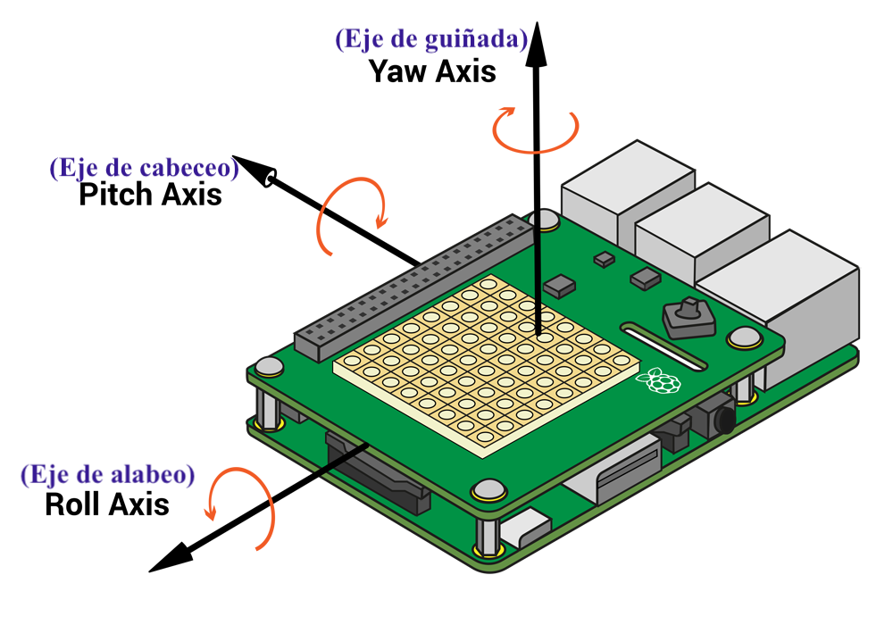
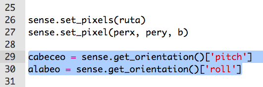
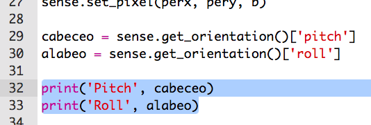
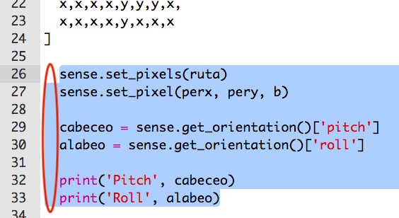
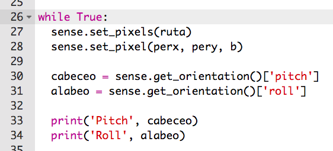

## Alabeo, cabeceo y guiñada

Estarás inclinando el Sense HAT para mover a tu personaje. Empecemos por descubrir la **orientación** (la posición) de tu Sense HAT.

+ El Sense HAT puede detectar su **roll**, **pitch** y **yaw**.
    
    

+ Trate de arrastrar el Sense HAT para cambiar sus valores de alabeo, cabeceo y guiñado para ver cómo se mueve.
    
    
    
    **Pulse el botón de reiniciar para volver a colocar el Sense HAT a la posición inicial cuando haya terminado de probar.**

+ Sólo necesitamos el "pitch" y el "roll" para este proyecto, así que añade 2 líneas de código para obtener estos valores del Sense HAT.
    
    

+ Imprime el "pitch" y "roll" para probarlos.
    
    

+ Ejecuta tu código para probarlo, y cambia el "pitch" del Sense HAT para inclinar hacia la derecha. ¡Te darás cuenta de que el valor `pitch` impreso no cambia!
    
    

+ El problema es que solo estás recibiendo e imprimiendo el `pitch` y `roll` **una vez**.
    
    Para hacer esto repetidamente, primero tendrás que indentar todo el código para configurar los píxeles, así como obtener e imprimir los valores de `pitch` y `roll`.
    
    

+ Entonces puedes añadir `while True:` encima del código indentado para ejecutarlo para siempre.
    
    

+ Prueba tu código de nuevo, y esta vez deberías ver el cambio de valor `pitch` impreso.
    
    