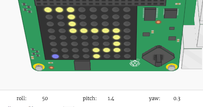

## Moviendo al personaje

Ahora vamos a mover a tu personaje cuando el Sensor HAT esté inclinado.

+ Mueve a tu personaje a la derecha si el Sense HAT `pitch` está entre `270` y `315` grados.
    
    

+ Añade este código para cambiar la posición x del personaje si el "pitch" está entre `270` y `315`:
    
    
    
    **Asegúrate de que este código esté indentado, de modo que el personaje se mueva repetidamente si el Sensor HAT está inclinado.**

+ Inclina tu Sense HAT para que el `pitch ` esté entre `270` y `315` grados. ¡Deberías ver que tu personaje se mueve a la derecha, pero sigue saliendo de la pantalla!
    
    
    
    También verá un error, ya que la posición x del personaje va por encima de 7, lo que no es una posición válida en la pantalla.
    
    

+ Para solucionar esto, sólo quieres mover tu personaje a la derecha si su posición actual es inferior a 7.
    
    

+ Prueba tu código mejorado, y ahora deberías ver que tu personaje se mueve **hasta que llegue al lado derecho de la pantalla**.
    
    

+ También queremos mover tu personaje a la izquierda cuando el `pitch ` esté entre `45` y `90` grados.
    
    

+ Añade este código para mover tu personaje a la izquierda si el `pitch` está entre `45` y `90`, pero **sólo si el personaje no está ya a la izquierda de la pantalla**.
    
    

+ Prueba tu código para asegurarte de que puedes inclinar tu personaje hacia la izquierda.

+ A continuación, añadamos el código para cambiar la **y-position**de tu personaje, moviéndola hacia abajo cuando el valor de **`roll`** está entre `45` y `90`.
    
    

+ prueba este código para ver si puedes inclinar el Sense HAT para mover hacia abajo a tu personaje.
    
    

+ Si quieres ralentizar tu juego, puedes añadir `sleep` al final de tu `while True:` bucle.
    
    