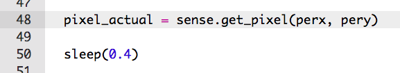
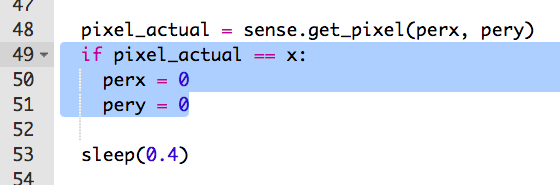

## Volviendo al inicio

Vamos a poner a tu personaje de vuelta al principio si cae fuera del camino

+ Es posible que hayas notado que nada sucede cuando el personaje se cae del camino.
    
    

+ Para arreglar esto, vamos a enviar al personaje de vuelta al principio si está de pie sobre un píxel negro.
    
    Comencemos por obtener el color del píxel al que se ha movido el personaje.
    
    

+ Si el color del píxel actual es negro, envía al personaje de vuelta al comienzo.
    
    

+ Prueba tu código y deberías ver que tu personaje vuelve al principio si caen del camino.