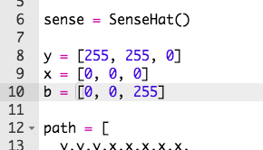

## Draw your player

Let's add the character to your game.

+ First, create another colour variable for your character. Here's how to create blue:
    
    

+ Next you need to create variables to store your character's x and y position. To start with, we'll set these both to `0`, which is the top-left of the Sense HAT.
    
    

+ To display your character, use `set_pixel`. You need to tell `set_pixel` the x and y position of the pixel to set, as well as the colour.
    
    

+ Test your code, and you should now see your character in the top-left of the screen.
    
    