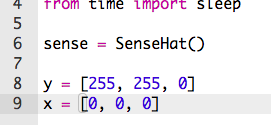
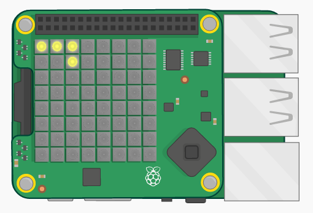

## एक रास्ता बनाएँ

आइए पहले हम वह रास्ता बनाएँ जिस पर आपके पात्र को अवश्य चलना है।

+ Tightrope स्टार्टर Trinket को खोलें: <a href="http://jumpto.cc/tightrope-go" target="_blank">jumpto.cc/tightrope-go</a>।
    
    **आपके लिए Sense HAT को सेट अप करने का कोड शामिल किया गया है।**

+ आइए उन रंगों को संगृहीत करने के लिए वेरिएबल बनाकर आरंभ करें जिनका आप उपयोग करना चाहते हैं। याद रखें कि किसी एक LED का रंग सेट करने के लिए, आपको यह बताना होगा कि इसमें कितना लाल, हरा और नीला होना चाहिए।
    
    पीला बनाने के लिए, आपको अधिकतम लाल और हरे रंग की आवश्यकता होगी, और नीले की बिलकुल नहीं:
    
    
    
    (यदि आप चाहें, तो आप [jumpto.cc/colours](http://jumpto.cc/colours) पर जाकर अपनी पसंद का कोई भी रंग चुन सकते हैं!

+ आपको रास्ते के चारों ओर काले पिक्सेल (या अपनी पसंद के किसी भी रंग) की आवश्यकता होगी
    
    

+ अपना रास्ता बनाने के लिए, आपको सबसे पहले एक सूची बनानी होगी जिसमें प्रत्येक पिक्सेल का रंग हो।
    
    
    
    **टाइपिंग को बचाने के लिए आप अपने प्रोजेक्ट `snippets.py` में से कोड कॉपी कर सकते हैं।**
    
    

+ इसके बाद, आपको अपने रास्ते की छवि को Sense HAT पर प्रदर्शित करने के लिए `set_pixels` का आह्वान करना होगा।
    
    

+ अपने कोड का परीक्षण करने के लिए 'Run' (चलाएँ) पर क्लिक करें। आपको उन स्थानों पर एक पीला पिक्सेल दिखाई देना चाहिए, जहाँ आपने अपने `y` वेरिएबल का उपयोग किया है, और उन स्थानों पर कोई रंग नहीं दिखाई देना चाहिए जहाँ आपने `x` का उपयोग किया है।
    
    