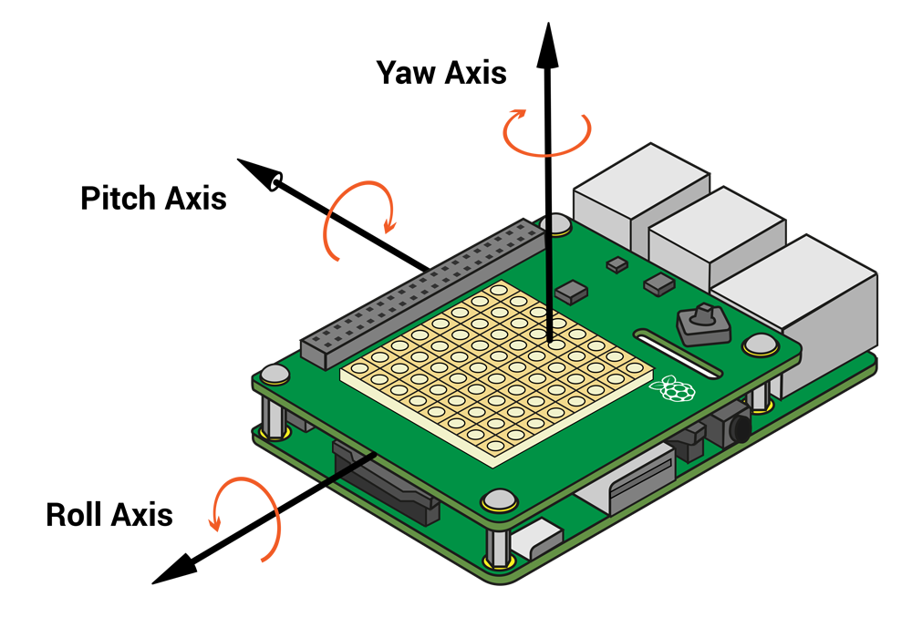

## रोल, पिच और जंभाई

आप अपने पात्र को चलाने के लिए Sense HAT को झुकाएँगे। चलो अपने सेंस हैट के **ऑरिएंटेशन** (स्थिति) को ढूंढकर शुरू करते हैं ।

+ Sense HAT अपनी **roll**, **pitch** और **yaw** स्थिति का पता लगा सकता है।
    
    

+ Sense HAT खींचने के लिए अपने रोल, पिच और जम्हाई मूल्यों को बदलने के लिए देखने के लिए कि यह कैसे चलता है की कोशिश करो ।
    
    
    
    **जब आप परीक्षण पूरा कर लें तो Sense HAT को वापस आरंभ की स्थिति में लाने के लिए रीसेट बटन को दबाएँ।**

+ हमें इस प्रोजेक्ट के लिए केवल pitch और roll की ज़रूरत है, इसलिए Sense Hat से इन मानों को प्राप्त करने के लिए कोड की 2 पंक्तियाँ जोड़ें।
    
    

+ पिच को प्रिंट करें और उन्हें परखने के लिए रोल करें।
    
    

+ इसका परीक्षण करने के लिए अपना कोड चलाएँ, और Sense HAT को दाईं ओर झुकाने के लिए इसकी pitch को बदलें। आप देखेंगे कि मुद्रित `पिच` मूल्य नहीं बदलता है!
    
    

+ समस्या यह है कि आप `pitch` और `roll` को केवल **एक बार** ही प्राप्त और प्रिंट कर रहे हैं।
    
    ऐसा बार-बार करने के लिए, पहले आपको पिक्सल सेट करने के लिए अपने सभी कोड को इंडेंट करना होगा, साथ ही `pitch` और `roll` मानों को प्राप्त और प्रिंट करना होगा।
    
    

+ फिर इसे हमेशा के लिए चलाने के लिए आप इंडेंट किए गए कोड के ऊपर `while True:` जोड़ सकते हैं।
    
    

+ अपने कोड का दोबारा परीक्षण करें, और इस बार आपको प्रिंट हुआ `pitch` मान बदला हुआ दिखाई देना चाहिए।
    
    