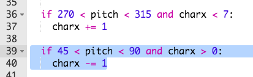
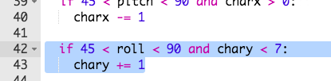
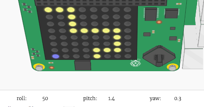
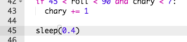

## पात्र को चलाना

आइए अब हम आपके पात्र को तब चलाएँ जब Sense HAT झुका हुआ हो।

+ आइए हम आपके पात्र को तब दाईं ओर चलाएँ जब Sense HAT की `pitch` `270` और `315` डिग्री के बीच हो।
    
    

+ यदि झुकाव `270` और `315` के बीच है, तो पात्र x का स्थान बदलने के लिए इस कोड को जोड़ें:
    
    
    
    **सुनिश्चित करें कि इस कोड को इंडेंट किया गया है, ताकि यदि Sense HAT झुका हुआ है तो पात्र बार-बार चलता है।**

+ अपने Sense HAT को इस तरह झुकाएँ कि `pitch` `270` और `315` डिग्री के बीच हो। आपको यह दिखाई देना चाहिए कि आपका पात्र दाईं ओर चलता है, लेकिन वह डिस्प्ले के बाहर जाता रहता है!
    
    
    
    आपको एक त्रुटि भी दिखाई देगी, क्योंकि पात्र की x स्थिति 7 से ऊपर चली जाती है, जो डिस्पले पर मान्य स्थिति नहीं है।
    
    

+ इसे ठीक करने के लिए, आप अपने पात्र को दाईं ओर केवल तभी ले जाना चाहेंगे जब इसकी वर्तमान स्थिति 7 से कम हो।
    
    

+ अपने सुधारे गए कोड का परीक्षण करें, और अब आपको यह दिखाई देना चाहिए कि आपका पात्र **तब तक चलता है, जब तक वह डिस्प्ले के दाईं ओर नहीं चला जाता है**।
    
    

+ हम आपके पात्र को तब बाईं ओर भी चलाना चाहते हैं जब `pitch` `45` और `90` डिग्री के बीच हो।
    
    

+ अपने पात्र को बाईं ओर चलाने के लिए इस कोड को जोड़ें अगर `pitch` `45` और `90` के बीच है, लेकिन **केवल तभी जब पात्र डिस्प्ले के दूर बाईं ओर नहीं है**।
    
    

+ यह सुनिश्चित करने के लिए अपने कोड का परीक्षण करें कि आप अपने पात्र को वापस बाईं ओर झुका सकते हैं।

+ इसके बाद, आइए आपके पात्र की **y-स्थिति** को बदलने के लिए हम कोड जोड़ते हैं, इसे तब नीचे ले जाकर जब **`roll`** का मान `45` और `90` के बीच हो।
    
    

+ यह देखने के लिए इस कोड का परीक्षण करें कि क्या आप अपने पात्र को नीचे ले जाने के लिए Sense HAT को झुका सकते हैं।
    
    

+ यदि आप अपने गेम को धीमा करना चाहते हैं, तो आप अपने `while True:` लूप के अंत में छोटा `sleep` जोड़ सकते हैं।
    
    