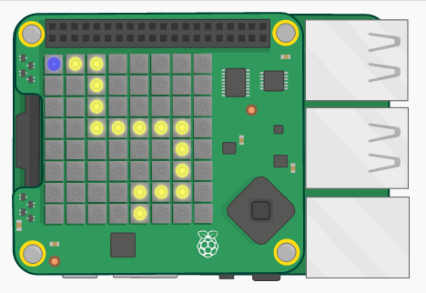

## はじめに

In this project you will create a game in which you have to tilt your Sense HAT to guide a character along a path. If you fall off the path, you have to start again from the beginning!

  <iframe src="https://trinket.io/embed/python/790adaa749?outputOnly=true&start=result" width="600" height="500" frameborder="0" marginwidth="0" marginheight="0" allowfullscreen mark="crwd-mark">
</iframe> 

### クラブリーダーのための追加情報

このプロジェクトを印刷する必要がある場合は、 [印刷用バージョン](https://projects.raspberrypi.org/en/projects/tightrope/print)を使用してください。

## \--- collapse \---

## title：クラブリーダー・ノート

## はじめに

In this project, children will learn about the Sense HAT orientation sensor by creating a line-follownig game. The player tilts the Sense HAT to move the character along a path. Deviating from the path sends the player back to the start!

## オンライン・リソース

**This project uses Python 3.** We recommend using [Trinket](https://trinket.io/) to write Python online. 本プロジェクトには、以下のtrinketが用意されています：

* ['Tightrope' Starter Trinket -- jumpto.cc/tightrope-go](http://jumpto.cc/tightrope-go)

また、完成版プログラムが入力済みのtrinketも用意されています。

* [‘Tightrope’ Finished -- trinket.io/python/790adaa749](https://trinket.io/python/790adaa749)

## オフライン・リソース

This project can also be [completed offline](https://www.codeclubprojects.org/en-GB/resources/physical-sense-hat/) on a Raspberry Pi computer with a Sense HAT. “プロジェクト資料”のリンクをクリックすることでこのプロジェクトのリソースにアクセスすることが可能です。 リンクには”プロジェクト・リソース”の個所もあり、ここにプロジェクトをオフラインで完成させるために必要なリソースが含まれている。 各子供がこのリソースのコピーを持っていることを確認してください。 このセクションは下記ファイルを含む：

* tightrope/main.py
* tightrope/snippets.py

また、以下の完成版プログラムは、「リーダー用ノート」セクションから入手可能です。

* tightrope-finished/main.py
* tightrope-finished/snippets.py

また、すべての上記のリソースはプロジェクトとボランティア`.zip` ファイルとしてダウンロードすることも可能。

## 学習目標

* Sense HAT orientation (roll, pitch and yaw);
* Sense HAT display;
* RGB colours;

このプロジェクトでは [Raspberry Pi デジタル・メイキング・カリキュラム](http://rpf.io/curriculum)（英語）の柱の一つである、プログラミングの以下の要素を学びます。

* [プログラミング構造を組み合わせて問題を解決する。](https://www.raspberrypi.org/curriculum/programming/builder)

## チャレンジ

* "Create your own path" - creating a image using a list of pixels;
* "Moving up!" - moving the character up in response to changing `roll` values.
* "Changing the difficulty" - testing the finished game and making changes based on player feedback.

\--- /collapse \---

## \--- collapse \---

## title: プロジェクト資料

## プロジェクト資料

* [全プロジェクト・リソースの入った.zipファイル](resources/tightrope-project-resources.zip)
* [Tightrope starter project](http://jumpto.cc/tightrope-go)
* [Offline starter Python file](resources/tightrope-main.py)
* [Offline Python file containing useful code](resources/tightrope-snippets.py)

## クラブ・リーダー向けリソース

* [全プロジェクトの完成版リソースの入った.zipファイル](resources/tightrope-volunteer-resources.zip)
* [Online completed Trinket Tightrope project](https://trinket.io/python/790adaa749)
* [tightrope-finished/main.py](resources/tightrope-finished-main.py)
* [tightrope-finished/snippets.py](resources/tightrope-finished-snippets.py)

\--- /collapse \---