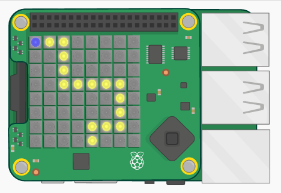

## ಪರಿಚಯ:

ಈ ಪ್ರಾಜೆಕ್ಟ್‌ನಲ್ಲಿ, ನೀವು ನಿಮ್ಮ Sense HAT ಅನ್ನು ವಾಲಿಸುವ ಮೂಲಕ ಒಂದು ಪಾತ್ರವನ್ನು ಒಂದು ಹಾದಿಯಲ್ಲಿ ಮುನ್ನಡೆಸುವಂತಹ ಒಂದು ಆಟವನ್ನು ರಚಿಸುತ್ತೀರಿ. ಹಾದಿಯಿಂದ ಕೆಳಗೆ ಬಿದ್ದಲ್ಲಿ, ನೀವು ಪುನಃ ಶುರುವಿನಿಂದ ಪ್ರಾರಂಭಿಸಬೇಕು!

  <iframe src="https://trinket.io/embed/python/790adaa749?outputOnly=true&start=result" width="600" height="500" frameborder="0" marginwidth="0" marginheight="0" allowfullscreen mark="crwd-mark">
</iframe> 

### ಸಂಘದ ಮುಖಂಡರಿಗೆ ಹೆಚ್ಚಿನ ಮಾಹಿತಿ

ನೀವು ಈ ಪ್ರಾಜೆಕ್ಟನ್ನು ಮುದ್ರಿಸಬೇಕಾದರೆ, ದಯವಿಟ್ಟು [ಮುದ್ರಕ-ಸ್ನೇಹಿ ಆವೃತ್ತಿ](https://projects.raspberrypi.org/en/projects/tightrope/print)ಯನ್ನು ಬಳಸಿ.

## \--- collapse \---

## title: ಸ೦ಘದ ಮುಖ೦ಡರಿಗೆ ಟಿಪ್ಪಣಿಗಳು

## ಪರಿಚಯ:

ಈ ಪ್ರಾಜೆಕ್ಟ್‌ನಲ್ಲಿ, ಮಕ್ಕಳು ಗೆರೆ-ಹಿಂಬಾಲಿಸುವಿಕೆ ಆಟವನ್ನು ರಚಿಸುವ ಮೂಲಕ Sense HAT ನಿಲುವು ಸಂವೇದಕದ ಬಗ್ಗೆ ಕಲಿಯುವರು. ಆಟಗಾರನು Sense HAT ಅನ್ನು ವಾಲಿಸುತ್ತಾ ಒಂದು ಪಾತ್ರವನ್ನು ಒಂದು ಹಾದಿಯಲ್ಲಿ ಮುನ್ನಡೆಸುತ್ತಾನೆ. ಹಾದಿ ಬದಲಿದರೆ ಆಟಗಾರ ಮತ್ತೆ ಪ್ರಾರಂಭಕ್ಕೆ ಮರಳಬೇಕಾಗುವುದು!

## ಆನ್‌ಲೈನ್ ಸಂಪನ್ಮೂಲಗಳು

**ಈ ಪ್ರಾಜೆಕ್ಟ್ Python 3 ಅನ್ನು ಬಳಸುತ್ತದೆ.** ನೀವು ಆನ್‌ಲೈನ್‌ನಲ್ಲಿ ಪೈಥಾನ್ ಬರೆಯಲು, [ ಟ್ರಿಂಕೆಟ್ (Trinket)](https://trinket.io/) ಬಳಸಲು ನಾವು ಶಿಫಾರಸು ಮಾಡುತ್ತೇವೆ. ಈ ಪ್ರಾಜೆಕ್ಟ್ ಈ ಕೆಳಗಿನ ಟ್ರಿಂಕೆಟ್‌ಗಳನ್ನು ಒಳಗೊಂಡಿದೆ:

* ['ಹಗ್ಗನಡಿಗೆ' ಪ್ರಾರಂಭಿಕ ಟ್ರಿಂಕೆಟ್ -- jumpto.cc/tightrope-go](http://jumpto.cc/tightrope-go)

ಒಂದು ಪೂರ್ಣವಾದ ಪ್ರಾಜೆಕ್ಟನ್ನು ಒಳಗೊಂಡಿರುವ ಟ್ರಿಂಕೆಟ್ ಸಹ ಇದೆ:

* ['ಹಗ್ಗನಡಿಗೆ' ಮುಕ್ತಾಯ -- trinket.io/python/790adaa749](https://trinket.io/python/790adaa749)

## ಆಫ್‌ಲೈನ್ ಸಂಪನ್ಮೂಲಗಳು

ಈ ಪ್ರಾಜೆಕ್ಟ್ ಅನ್ನು ಸೆನ್ಸ್ ಹ್ಯಾಟ್ (Sense HAT) ಹೊಂದಿರುವ ರಾಸ್ಪ್‌ಬೆರಿ ಪೈ (Raspberry Pi) ಕಂಪ್ಯೂಟರ್ ನಲ್ಲಿ [ಆಫ್‌ಲೈನ್‌ನಲ್ಲಿಯೂ ಪೂರ್ಣಗೊಳಿಸಬಹುದು.](https://www.codeclubprojects.org/en-GB/resources/physical-sense-hat/). ನೀವು ಪ್ರಾಜೆಕ್ಟ್ ಸಂಪನ್ಮೂಲಗಳನ್ನು ಈ ಪ್ರಾಜೆಕ್ಟ್‌ನ 'ಪ್ರಾಜೆಕ್ಟ್‌ ವಸ್ತುಗಳು' ಲಿಂಕ್ ಕ್ಲಿಕ್ ಮಾಡುವ ಮೂಲಕ ಪಡೆಯಬಹುದು. ಈ ಲಿಂಕ್ ನಲ್ಲಿ ಮಕ್ಕಳು ಈ ಪ್ರಾಜೆಕ್ಟನ್ನು ಆಫ್‌ಲೈನ್‌ನಲ್ಲಿ ಪೂರ್ಣಗೊಳಿಸಲು ಬೇಕಾದ ಸಂಪನ್ಮೂಲಗಳಿರುವ 'ಪ್ರಾಜೆಕ್ಟ್ ಸಂಪನ್ಮೂಲಗಳು' ಎಂಬ ವಿಭಾಗವಿದೆ. ಪ್ರತಿ ಮಗುವಿಗೂ ಈ ಸಂಪನ್ಮೂಲಗಳ ಒಂದು ಪ್ರತಿ ಲಭ್ಯವಿದೆ ಎಂದು ಖಚಿತಪಡಿಸಿಕೊಳ್ಳಿ. ಈ ವಿಭಾಗದಲ್ಲಿ ಈ ಕೆಳಗಿನ ಕಡತಗಳಿವೆ (ಫೈಲ್‌ಗಳು - files):

* tightrope/main.py
* tightrope/snippets.py

ಈ ಪ್ರಾಜೆಕ್ಟ್‌ನ ಒಂದು ಸಂಪೂರ್ಣ ಆವೃತ್ತಿಯು ಕೂಡ 'ಸ್ವಯಂಸೇವಕ ಸಂಪನ್ಮೂಲಗಳು' ವಿಭಾಗದಲ್ಲಿ ಲಭ್ಯವಿದೆ. ಇದರಲ್ಲಿ:

* tightrope-finished/main.py
* tightrope-finished/snippets.py

(ಮೇಲಿನ ಎಲ್ಲ ಕಡತಗಳನ್ನು ಪ್ರಾಜೆಕ್ಟ್ ಆಗಿ ಹಾಗೂ ಸ್ವಯಂಸೇವಕ `.ಝಿಪ್ (.zip)` ಕಡತಗಳಾಗಿ ಸಹ ಡೌನ್‌ಲೋಡ್ ಮಾಡಬಹುದು.)

## ಕಲಿಕೆಯ ಉದ್ದೇಶಗಳು

* Sense HAT ನಿಲುವು (ರೋಲ್ (roll), ಪಿಚ್ (pitch) ಮತ್ತು ಯಾವ್ (yaw));
* Sense HAT ದೃಶ್ಯಪರದೆ (display);
* ಆರ್ ಜಿ ಬಿ (RGB) ಬಣ್ಣಗಳು;

ಈ ಪ್ರಾಜೆಕ್ಟ್ [Raspberry Pi Digital Making Curriculum](http://rpf.io/curriculum)ನ ಈ ಕೆಳಗಿನ ಧಾತುಗಳ ಅಂಶಗಳನ್ನು ಒಳಗೊಂಡಿದೆ:

* [ಪ್ರೋಗ್ರಾಮಿಂಗ್ ರಚನೆಗಳನ್ನು ಒಟ್ಟಾಗಿಸಿ ಒಂದು ಸಮಸ್ಯೆಯನ್ನು ಬಿಡಿಸುವುದು.](https://www.raspberrypi.org/curriculum/programming/builder)

## ಸವಾಲುಗಳು

* "ನಿಮ್ಮದೇ ಮಾರ್ಗವನ್ನು ರಚಿಸಿ" - ಒಂದು ಪಿಕ್ಸೆಲ್‌ಗಳ ಪಟ್ಟಿಯನ್ನು ಬಳಸಿಕೊಂಡು ಒಂದು ಚಿತ್ರವನ್ನು ರಚಿಸುವುದು;
* "ಮೇಲಕ್ಕೆ ನಡೆಸುವುದು!" - `ರೋಲ್` ಮೌಲ್ಯಗಳ ಬದಲಾಯಿಸುವಿಕೆಗೆ ಸರಿಯಾಗಿ ಪಾತ್ರವನ್ನು ಮೇಲಕ್ಕೆ ನಡೆಸುವುದು.
* "ಜಟಿಲತೆಯನ್ನು ಬದಲಾಯಿಸುವುದು" - ಮುಗಿದ ಆಟವನ್ನು ಪರೀಕ್ಷಿಸುವುದು ಮತ್ತು ಆಟಗಾರರ ಪ್ರತಿಕ್ರಿಯೆಯ ಆಧಾರದ ಮೇರೆಗೆ ಬದಲಾವಣೆಗಳನ್ನು ಮಾಡುವುದು.

\--- /collapse \---

## \--- collapse \---

## title: ಪ್ರಾಜೆಕ್ಟ್‌ ವಸ್ತುಗಳು

## ಪ್ರಾಜೆಕ್ಟ್ ಸಂಪನ್ಮೂಲಗಳು

* [ಎಲ್ಲಾ ಪ್ರಾಜೆಕ್ಟ್ ಸಂಪನ್ಮೂಲಗಳನ್ನು ಒಳಗೊಂಡಿರುವ .ಝಿಪ್ (.zip) ಕಡತ](resources/tightrope-project-resources.zip)
* [ಹಗ್ಗನಡಿಗೆ ಆರಂಭಿಕ ಪ್ರಾಜೆಕ್ಟ್](http://jumpto.cc/tightrope-go)
* [ಆಫ್‌ಲೈನ್ ಪ್ರಾರಂಭಿಕ Python ಕಡತ](resources/tightrope-main.py)
* [ಉಪಯುಕ್ತ ಕೋಡ್ ಹೊಂದಿರುವ ಆಫ್‌ಲೈನ್ Python ಕಡತ](resources/tightrope-snippets.py)

## ಸಂಘದ ನಾಯಕರ ಸಂಪನ್ಮೂಲಗಳು

* [ಎಲ್ಲ ಪೂರ್ಣಗೊಂಡ ಪ್ರಾಜೆಕ್ಟ್ ಸಂಪನ್ಮೂಲಗಳನ್ನು ಹೊಂದಿರುವ.zip ಕಡತ](resources/tightrope-volunteer-resources.zip)
* [ಆನ್ಲೈನ್ ನಲ್ಲಿ ಸಂಪೂರ್ಣಗೊಂಡಿರುವ trinket Tightrope ಯೋಜನೆಗಳು](https://trinket.io/python/790adaa749)
* [tightrope-finished/main.py](resources/tightrope-finished-main.py)
* [tightrope-finished/snippets.py](resources/tightrope-finished-snippets.py)

\--- /collapse \---