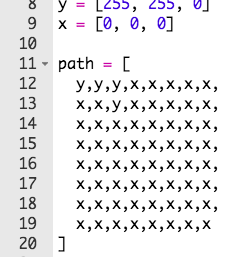

## ಒಂದು ಮಾರ್ಗವನ್ನು ಬರೆಯಿರಿ

ಮೊದಲು ನಿಮ್ಮ ಪಾತ್ರವು ಅನುಸರಿಸಬೇಕಾದ ಮಾರ್ಗವನ್ನು ಬರೆಯೋಣ.

+ ಹಗ್ಗನಡಿಗೆ ಪ್ರಾರಂಭಿಕ Trinket ಅನ್ನು ತೆರೆಯಿರಿ: <a href="http://jumpto.cc/tightrope-go" target="_blank">jumpto.cc/tightrope-go</a>.
    
    **Sense HAT ಅನ್ನು ಹೊಂದಿಸುವ code ಅನ್ನು ನಿಮಗಾಗಿ ಸೇರಿಸಲಾಗಿದೆ.**

+ ನೀವು ಬಳಸಲು ಬಯಸುವ ಬಣ್ಣಗಳನ್ನು ಸಂಗ್ರಹಿಸಲು ವೇರಿಯೇಬಲ್‌ಗಳನ್ನು ರಚಿಸುವ ಮೂಲಕ ಪ್ರಾರಂಭಿಸೋಣ. ಒಂದು ಪ್ರತ್ಯೇಕ ಎಲ್ಇಡಿ (LED)ಯ ಬಣ್ಣವನ್ನು ಹೊಂದಿಸಲು, ಅದು ಎಷ್ಟು ಕೆಂಪು, ಹಸಿರು ಮತ್ತು ನೀಲಿಗಳನ್ನು ಹೊಂದಿರಬೇಕೆಂದು ನೀವು ಹೇಳಬೇಕೆಂಬುದನ್ನು ನೆನಪಿಡಿ.
    
    ಹಳದಿ ಬಣ್ಣವನ್ನು ಮಾಡಲು, ನಿಮಗೆ ಅತಿ ಹೆಚ್ಚುಕೆಂಪು ಮತ್ತು ಹಸಿರು ಬೇಕು, ಮತ್ತು ನೀಲಿ ಬೇಡ:
    
    
    
    (ನೀವು ಬಯಸಿದರೆ, ನೀವು [jumpto.cc/colours](http://jumpto.cc/colours)ಗೆ ಹೋಗಿ ನಿಮಗಿಷ್ಟವಾದ ಬಣ್ಣವನ್ನು ಆರಿಸಿಕೊಳ್ಳಬಹುದು)!

+ ನಿಮಗೆ ಹಾದಿಯ ಸುತ್ತ ಕಪ್ಪು ಪಿಕ್ಸೆಲ್‌ಗಳು (ಅಥವಾ ನಿಮ್ಮಿಚ್ಛೆಯ ಯಾವುದೇ ಬಣ್ಣ) ಕೂಡಾ ಬೇಕು.
    
    

+ ನಿಮ್ಮ ಹಾದಿಯನ್ನು ಬಿಡಿಸಲು, ಮೊದಲು ನೀವು ಪ್ರತಿ ಪಿಕ್ಸೆಲ್‌ನ ಬಣ್ಣವನ್ನು ಒಳಗೊಂಡಿರುವ ಒಂದು ಪಟ್ಟಿಯನ್ನು ಮಾಡಬೇಕು.
    
    
    
    **ಟೈಪಿಂಗ್ ಉಳಿಸಲು ನೀವು ನಿಮ್ಮ ಪ್ರಾಜೆಕ್ಟ್‌ನಲ್ಲಿರುವ `snippets.py` ನಿಂದ ಕೋಡ್ ಅನ್ನು ನಕಲು ಮಾಡಬಹುದು.**
    
    

+ ಮುಂದೆ, ನಿಮ್ಮ ಹಾದಿಯ ಚಿತ್ರವನ್ನು ಸೆನ್ಸ್ ಹ್ಯಾಟ್‌ನಲ್ಲಿ ಪ್ರದರ್ಶಿಸಲು, ನೀವು `set_pixels` ಅನ್ನು ಕರೆಯಬೇಕು.
    
    

+ ನಿಮ್ಮ ಕೋಡ್ ಅನ್ನು ಪರೀಕ್ಷಿಸಲು 'Run' ಕ್ಲಿಕ್ ಮಾಡಿ. ನೀವು ನಿಮ್ಮ `y` ವೇರಿಯೇಬಲ್ ಉಪಯೋಗಿಸಿದ ಜಾಗಗಳಲ್ಲೆಲ್ಲ ನಿಮಗೆ ಒಂದು ಹಳದಿ ಪಿಕ್ಸೆಲ್ ಕಾಣಿಸಬೇಕು, ಮತ್ತು `x` ವೇರಿಯೇಬಲ್ ಉಪಯೋಗಿಸಿದಲ್ಲೆಲ್ಲಾ ಯಾವುದೇ ಬಣ್ಣ ಕಾಣಿಸಬಾರದು.
    
    