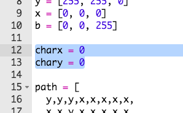

## ನಿಮ್ಮ ಆಟಗಾರನನ್ನು ಬರೆಯಿರಿ

ನಿಮ್ಮ ಆಟಕ್ಕೆ ಪಾತ್ರವನ್ನು ಸೇರಿಸೋಣ.

+ ಮೊದಲಿಗೆ, ನಿಮ್ಮ ಪಾತ್ರಕ್ಕಾಗಿ ಮತ್ತೊಂದು ಬಣ್ಣ ವೇರಿಯೇಬಲ್ ಅನ್ನು ರಚಿಸಿ. ನೀಲಿಯನ್ನು ರಚಿಸುವುದು ಹೇಗೆಂಬುದು ಇಲ್ಲಿದೆ:
    
    

+ ಮುಂದೆ ನೀವು ನಿಮ್ಮ ಪಾತ್ರದ x ಮತ್ತು y ಸ್ಥಾನಗಳನ್ನು ಸಂಗ್ರಹಿಸಲು ವೇರಿಯೇಬಲ್‌ಗಳನ್ನು ರಚಿಸಬೇಕು. ಶುರುವಿನಲ್ಲಿ ನಾವು ಇವೆರಡನ್ನೂ `0`ಗೆ ಹೊಂದಿಸೋಣ; ಅದು Sense HAT ಎಡ ಮೇಲ್ತುದಿ.
    
    

+ ನಿಮ್ಮ ಪಾತ್ರವನ್ನು ತೋರಿಸಲು `set_pixel` ಅನ್ನು ಬಳಸಿ. ಹೊಂದಿಸಬೇಕಾದ ಪಿಕ್ಸೆಲ್ ನ x ಮತ್ತು y ಸ್ಥಾನಗಳನ್ನು, ಹಾಗೂ ಅದರ ಬಣ್ಣವನ್ನು ನೀವು `set_pixel`ಗೆ ಹೇಳಬೇಕು.
    
    

+ ನಿಮ್ಮ ಕೋಡ್ ಅನ್ನು ಪರೀಕ್ಷಿಸಿ; ಈಗ ನಿಮ್ಮ ಪಾತ್ರವು ಪರದೆಯ ಎಡ ಮೇಲ್ತುದಿಯಲ್ಲಿ ಕಾಣಿಸಬೇಕು.
    
    