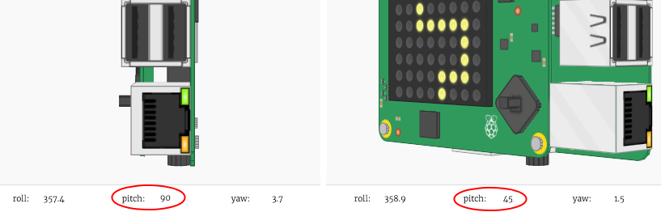

## ಪಾತ್ರವನ್ನು ನಡೆಸುವುದು

ಈಗ Sense HAT ಓರೆಯಾದಾಗ ನಿಮ್ಮ ಪಾತ್ರವನ್ನು ನಡೆಸೋಣ.

+ Sense HAT `ಪಿಚ್` `270` ಮತ್ತು `315` ಡಿಗ್ರೀ ನಡುವೆ ಇದ್ದರೆ ನಾವು ನಿಮ್ಮ ಪಾತ್ರವನ್ನು ಬಲಬದಿಗೆ ನಡೆಸೋಣ.
    
    

+ ಪಿಚ್ `270` ಮತ್ತು `315` ಡಿಗ್ರೀ ನಡುವೆ ಇದ್ದಾಗ ಪಾತ್ರದ x ಸ್ಥಾನವನ್ನು ಬದಲಿಸಲು ಈ ಕೋಡ್ ಅನ್ನು ಸೇರಿಸಿ:
    
    
    
    **Sense HAT ವಾಲಿದಾಗಲೆಲ್ಲ ಪಾತ್ರವು ಪದೇ ಪದೇ ಸರಿಯುವಂತೆ ನೋಡಿಕೊಳ್ಳಲು, ಈ ಕೋಡ್ ಇಂಡೆಂಟ್ ಆಗಿರುವಂತೆ ಖಚಿತಪಡಿಸಿಕೊಳ್ಳಿ.**

+ `ಪಿಚ್` `270` ಮತ್ತು `315` ಡಿಗ್ರೀ ನಡುವೆ ಬರುವಂತೆ ನಿಮ್ಮ Sense HAT ಅನ್ನು ವಾಲಿಸಿ. ನಿಮ್ಮ ಪಾತ್ರವು ಬಲಬದಿಗೆ ಚಲಿಸುವುದನ್ನು ನೋಡುವಿರಿ; ಆದರೆ ಅದು ಪದೇ ಪದೇ ತೆರೆಯಿಂದ ಆಚೆಗೆ ಹೋಗುವುದು!
    
    
    
    ನೀವು ಒಂದು ತಪ್ಪನ್ನು ಸಹ ನೋಡುವುರಿ, ಏಕೆಂದರೆ, ಪಾತ್ರದ x ಸ್ಥಾನವು 7ರ ಮೇಲೆ ಹೋಗುವುದು, ಮತ್ತು ಅದು ತೆರೆಯ ಮೇಲೆ ಒಂದು ಸರಿಯಾದ ಸ್ಥಾನವಲ್ಲ.
    
    

+ ಇದನ್ನು ಸರಿಪಡಿಸಲು, ನಿಮ್ಮ ಪಾತ್ರದ ಪ್ರಸಕ್ತ ಸ್ಥಾನ 7ಕ್ಕಿಂತ ಕಡಿಮೆ ಇದ್ದಾಗ ಮಾತ್ರ ಅದನ್ನು ಬಲಬದಿಗೆ ಸರಿಸುವುದನ್ನು ನೀವು ಬಯಸುತ್ತೀರಿ.
    
    

+ ನಿಮ್ಮ ಸುಧಾರಿತ ಕೋಡ್ ಅನ್ನು ಪರೀಕ್ಷಿಸಿ, ಮತ್ತು ಈಗ ನಿಮ್ಮ ಪಾತ್ರವು **ತೆರೆಯ ಬಲ ಅಂಚಿಗೆ ಬರುವವರೆಗೆ ಮಾತ್ರ** ಸರಿಯುವುದನ್ನು ನೀವು ನೋಡುವುರಿ.
    
    

+ `ಪಿಚ್` `45` ಮತ್ತು `90` ಡಿಗ್ರೀ ಮಧ್ಯೆ ಇದ್ದಾಗ ನಿಮ್ಮ ಪಾತ್ರವನ್ನು ಎಡಬದಿಗೆ ಸರಿಸುವುದನ್ನು ಕೂಡಾ ನಾವು ಬಯಸುತ್ತೇವೆ.
    
    

+ `ಪಿಚ್` `45` ಮತ್ತು `90` ಡಿಗ್ರೀ ಮಧ್ಯೆ ಇದ್ದಾಗ, ನಿಮ್ಮ **ಪಾತ್ರವು ಈಗಾಗಲೇ ತೆರೆಯ ಎಡದ ಅಂಚಿನಲ್ಲಿ ಇಲ್ಲದಿದ್ದರೆ ಮಾತ್ರ** ಅದನ್ನು ಎಡಕ್ಕೆ ಸರಿಸಲು ಈ ಕೋಡ್ ಅನ್ನು ಸೇರಿಸಿ.
    
    

+ ನಿಮ್ಮ ಪಾತ್ರವನ್ನು ಪುನಃ ಎಡಕ್ಕೆ ವಾಲಿಸಬಲ್ಲಿರೆಂದು ಖಚಿತಪಡಿಸಿಕೊಳ್ಳಸು ನಿಮ್ಮ ಕೋಡ್ ಅನ್ನು ಪರೀಕ್ಷಿಸಿ.

+ ಮುಂದೆ **`roll`** ಮೌಲ್ಯ `45` ಮತ್ತು `90` ರ ಮಧ್ಯೆ ಇರುವಾಗ ನಿಮ್ಮ ಪಾತ್ರದ **y-position** ಬದಲಿಸಿ ಅದನ್ನು ಕೆಳಗೆ ಸರಿಸಲು ಕೋಡ್ ಸೇರಿಸೋಣ.
    
    

+ ನೀವು ಸೆನ್ಸ್ ಹ್ಯಾಟ್ ಅನ್ನು ವಾಲಿಸಿ ನಿಮ್ಮ ಪಾತ್ರವನ್ನು ಕೆಳಗಡೆ ಸರಿಸಬಲ್ಲಿರೇ ಎಂದು ನೋಡಲು ಈ ಕೋಡ್ ಅನ್ನು ಪರೀಕ್ಷಿಸಿ.
    
    

+ ಆಟವನ್ನು ನಿಧಾನಿಸಲು ಬಯಸಿದರೆ ನೀವು ನಿಮ್ಮ `while True:` ಲೂಪ್‌ನ ಕೊನೆಗೆ ಚಿಕ್ಕ `sleep` ಅನ್ನು ಸೇರಿಸಬಹುದು.
    
    