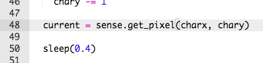

## ಆರಂಭಕ್ಕೆ ಹಿಂದಿರುವುಗುದು

ನಿಮ್ಮ ಪಾತ್ರವು ಹಾದಿಯಿಂದ ಕೆಳಗೆ ಬಿದ್ದಾಗ ಅದನ್ನು ಪುನಃ ಆರಂಭಕ್ಕೆ ಸೇರಿಸೋಣ.

+ ನಿಮ್ಮ ಪಾತ್ರವು ಹಾದಿಯಿಂದ ಕೆಳಗೆ ಬಿದ್ದಾಗ ಏನೂ ಆಗುವುದಿಲ್ಲವೆಂಬುದನ್ನು ನೀವು ಗಮನಿಸಿರುತ್ತೀರಿ.
    
    

+ ಇದನ್ನು ಸರಿಪಡಿಸಲು, ಪಾತ್ರವು ಕಪ್ಪು ಪಿಕ್ಸೆಲ್ ಮೇಲೆ ನಿಂತಾಗ ನಾವು ಅದನ್ನು ಪುನಃ ಆರಂಭಕ್ಕೆ ಕಳುಹಿಸಲಿದ್ದೇವೆ.
    
    ಪಾತ್ರವು ಯಾವ ಪಿಕ್ಸೆಲ್ ಮೇಲೆ ಹೋಗಿದೆಯೋ ಅದರ ಬಣ್ಣವನ್ನು ಪಡೆಯುವ ಮೂಲಕ ಆರಂಭಿಸೋಣ.
    
    

+ ಪ್ರಸಕ್ತ ಪಿಕ್ಸೆಲ್‌ನ ಬಣ್ಣವು ಕಪ್ಪು ಆಗಿದ್ದಲ್ಲಿ ಪಾತ್ರವನ್ನು ಪುನಃ ಆರಂಭಕ್ಕೆ ಕಳುಹಿಸಿ.
    
    

+ ನಿಮ್ಮ ಕೋಡ್ ಅನ್ನು ಪರೀಕ್ಷಿಸಲಾಗಿ, ನಿಮ್ಮ ಪಾತ್ರವು ಹಾದಿಯಿಂದ ಕೆಳಗೆ ಜಾರಿದಾಗೆಲ್ಲ ಅದು ಪುನಃ ಆರಂಭಕ್ಕೆ ಹಿಂದಿರುಗುವುದನ್ನು ನೀವು ಕಾಣಬೇಕು.