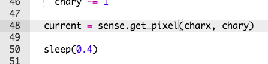

## Going back to the start

Let's put your character back to the start when it falls off the path.

+ You may have noticed that nothing happens when the character falls off the path.
    
    

+ To fix this, we're going to send the character back to the start if they're standing on a black pixel.
    
    Let's start by getting the colour of the pixel the character has moved to.
    
    

+ If the colour of the current pixel is black, then send the character back to the start.
    
    

+ Test your code and you should see your character move back to the start if they fall off the path.