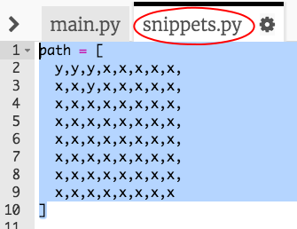

## एक मार्ग आखा

प्रथम आपल्या पात्राला चालता येईल असे मार्ग आखू.

+ दोरखंड स्टार्टर Trinket उघडा: <a href="http://jumpto.cc/tightrope-go" target="_blank">jumpto.cc/tightrope-go</a>.
    
    **Sense HAT सेट करण्यासाठी कोड आपल्यासाठी समाविष्ट केले गेले आहे.**

+ सुरवात आपण वापरू इच्छित असलेले रंग संचयित करण्यासाठी वॅरीएबल बनवून करूया. लक्षात ठेवा की प्रत्येक एलईडी(LED) चा रंग सेट करण्यासाठी आपल्याला त्यात किती लाल, हिरवा आणि निळा असावा हे सांगणे आवश्यक आहे.
    
    पिवळा तयार करण्यासाठी आपल्याला लाल आणि हिरवा रंग महत्तम आणि निळा अजिबात नसण्याची आवश्यकता आहे:
    
    
    
    (आपण हवे तर [jumpto.cc/colours](http://jumpto.cc/colours) वर जाऊन आपला आवडता रंग निवडू शकता!)

+ आपल्याला मार्गाच्या आसपास काळ्या (किंवा आपल्याला आवडत असलेला कोणताही) रंगाचे पिक्सेल देखील आवश्यक असतील.
    
    

+ आपला मार्ग रेखांकित करण्यासाठी प्रथम आपल्याला प्रत्येक पिक्सेलचा रंग असलेली सूची तयार करण्याची गरज आहे.
    
    
    
    **टायपिंग वाचवण्यासाठी आपण `snippets.py` या कोड ची प्रत आपल्या प्रोजेक्ट मध्ये घेऊ शकता.**
    
    

+ पुढे, Sense Hat वर आपल्या मार्गाची प्रतिमा प्रदर्शित करण्यासाठी आपल्याला `set_pixels` कॉल करण्याची गरज आहे.
    
    

+ आपल्या कोड ची चाचणी करण्यासाठी 'Run' वर क्लिक करा. आपण जिथे-जिथे `y` वॅरीएबल वापरले आहे तिथे पिवळे, आणि जिथे-जिथे `x` वापरले आहे तिथे बेरंग पिक्सेल दिसले पाहिजेत.
    
    