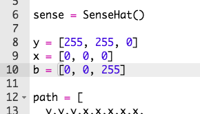
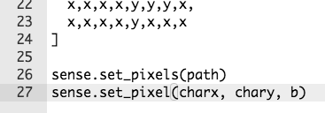

## आपला पात्र रेखाटा

चला आपल्या खेळामध्ये एक पात्र जोडूया.

+ प्रथम, आपल्या पात्रासाठी एका दुसऱ्या रंगाचा वॅरीएबल बनवा. निळा कसा तयार करावा ते येथे आहे:
    
    

+ पुढे आपल्या पात्राचे x आणि y स्थान संचयित करण्यासाठी आपल्याला वॅरीएबल तयार करण्याची गरज आहे. सुरुवात करण्यासाठी, आपण हे दोन्ही `0` वर सेट करू, जे Sense Hat वर वरून-डावीकडे आहे.
    
    

+ आपले पात्र प्रदर्शित करण्यासाठी `set_pixel` वापरा. आपल्याला पिक्सेलची x आणि y स्थिती तसेच त्याचे रंग कुठले सेट करायचे हे `set_pixel` ला सांगावे लागेल.
    
    

+ आपल्या कोडची चाचणी घ्या, आणि आपण आता आपले पात्र स्क्रीनच्या वरून-डाव्या बाजूला पाहू शकता.
    
    