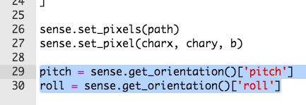
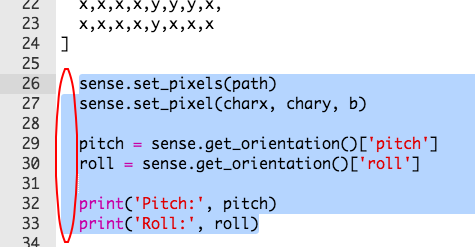
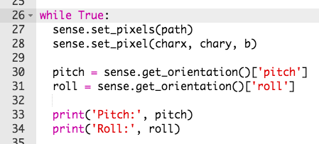

## रोल, पिच आणि यॉ

आपण आपले पात्र हलविण्यासाठी Sense Hat झुकवणार आहात. सुरुवात आपल्या Sense Hat ची **अभिमुखता** (स्थिती) शोधण्यापासून करूया.

+ Sense Hat त्याची **रोल**(roll), **पिच** (pitch) आणि **यॉ**(yaw) शोधू शकते.
    
    

+ Sense Hat ला ड्रॅग करून त्याची रोल, पिच आणि यॉ व्हॅल्यूज बदला, आणि ती कशी फिरते हे पहा.
    
    
    
    **आपण चाचणी पूर्ण झाल्यावर Sense Hat पुन्हा सुरुवातीच्या स्थितीवर आणण्यासाठी रीसेट बटण दाबा.**

+ आपल्याला या प्रोजेक्टसाठी फक्त पिच आणि रोल आवश्यक आहेत, तर Sense Hat मधून ही मूल्ये मिळविण्यासाठी कोडच्या 2 ओळी जोडा.
    
    

+ pitch आणि roll ची चाचणी करण्यासाठी त्यांना प्रिंट करा.
    
    

+ आपल्या कोड ची चाचणी करण्यासाठी त्याला रन करा आणि Sense Hat ला उजवी कडे वाळवून पिच बदलतयं का ते पहा. आपल्याला लक्षात येईल कि प्रिंट केलेले `पिच` बदलत नाहीये!
    
    

+ समस्या अशी आहे कि आपण `pitch` आणि `roll` फक्त **एकदाच** प्रिंट करत आहोत.
    
    हे वारंवार करण्यासाठी आपल्याला प्रथम आपला सर्व कोड थोडा पुढे सरकवावा (indent) लागेल, जेणेकरून आपण पिक्सेल सेट करू शकाल तसेच ` pitch` आणि `roll` मूल्ये मिळवून प्रिंट करू शकाल.
    
    

+ ह्या पुढे सरकवलेल्या कोड च्या वरती आपण `while True:` जोडू शकता जेणेकरून तो कायमंच चालत राहील.
    
    

+ आपल्या कोडची पुन्हा चाचणी करा आणि यावेळी आपण प्रिंट झालेल्या `pitch` चे मूल्य बदलतांना पाहू शकता.
    
    