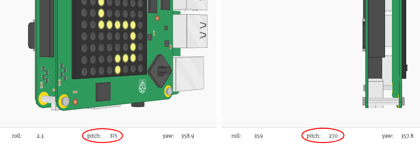

## पात्राला हलविणे

आता जेव्हा Sense Hat तिरपे होईल तेव्हा पात्राला हलवायचे आहे.

+ Sense Hat चा `pitch` `270` आणि `315` डिग्री मध्ये असल्यास आपण आपल्या पात्राला हलवू.
    
    

+ पिच `270` आणि `315` अंश मध्ये असल्यास आपल्या पात्राची x स्थिती बदलण्यासाठी हा कोडे जोडा:
    
    
    
    **हा कोड पुढे सरकावलेला(indented) असल्याची खात्री करा, जेणेकरून Sense Hat झुकेल तेव्हा पात्रं हलत राहील.**

+ आपली Sense Hat अशी झुकवा जेणेकरुन `pitch` `270` आणि `315` अंश मध्ये येईल. आपल्याला दिसेल कि आपलं पात्रं उजवीकडे सरकत आहे, पण ते डिस्प्ले च्या बाहेर जात राहतं!
    
    
    
    आपणास एक एरर देखील दिसेल, कारण पात्राची x पोजीशन 7 च्या वर जाईल, जे डिस्प्लेवर वैध स्थान नाही.
    
    

+ याचे निराकरण करण्यासाठी, आपल्याला पात्राला तेव्हाच उजवीकडे हलवायचे आहे जेव्हा त्याची सध्याची स्थिती 7 हुन कमी असेल.
    
    

+ आपल्या सुधारलेल्या कोड ची चाचणी करा, आणि आता आपले पात्र **डिस्प्ले च्या उजव्या बाजूला येईपर्यंत** सरकेल.
    
    

+ आपल्याला `pitch` `45` आणि `90` अंशाच्या मध्ये असल्यावर पात्रं डावीकडे पण सरकवायचे आहे.
    
    

+ `pitch` `45` आणि `90` अंशाच्या मध्ये असल्यावर आणि **पात्र आधीच डिस्प्ले च्या डावीकडे नसल्यावरच** त्याला डावीकडे हलवायला हा कोड जोडा.
    
    

+ आपण आपले पात्रं डावीकडे परत हलवू शकता हे सुनिश्चित करण्यासाठी आपल्या कोडची चाचणी करा.

+ पुढे, **roll** मूल्य `45` आणि `90` अंशामध्ये असल्यावर पात्राला खाली हलवण्यासाठी त्याची <0>y स्थिती</0> बदलायला हा कोडे जोडूया.
    
    

+ Sense Hat झुकवल्यावर आपला पात्रं खाली सरकतोय का हे पाहण्यासाठी कोड ची चाचणी करा.
    
    

+ आपल्या खेळाची गती कमी करू इच्छित असल्यास, आपण `while True:` लूप च्या शेवटी एक लहान `sleep` जोडू शकता.
    
    