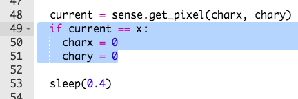

## परत सुरवातीला जाणे

आपलं पात्रं वाटेवरून पडल्यावर त्याला पुन्हा सुरुवातीला ठेवूया.

+ आपल्या लक्षात आले असेल की पात्राला वाटेवरून पडल्यावर काहीही होत नाही.
    
    

+ हे निराकरण करण्यासाठी, आपण ते काळ्या पिक्सेलवर उभे असल्यास पात्राला परत सुरुवातीस पाठवणार आहोत.
    
    सुरुवात पात्रं जिथे हलवले गेले आहे त्या पिक्सेलचा रंग मिळवण्या पासून करूया.
    
    

+ जर सध्याच्या पिक्सेलचा रंग काळा असेल तर पात्राला पुन्हा सुरवातीला पाठवा.
    
    

+ आपल्या कोडची चाचणी करा आणि आता वाटेवरून खाली पडल्यावर पात्रं सुरुवातीला गेलेलं दिसलं पाहिजे.