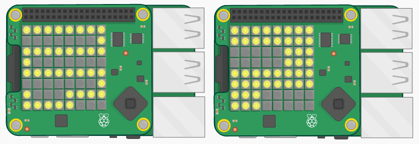

--- challenge ---

## आव्हान: अडचणीची पातळी बदलणे

काही मित्रांना आपला खेळ तपासायला सांगा. काय त्यांना ते खूप सोपे किंवा खूप कठीण वाटले? तसे असल्यास, आपण काही बदल करू शकता:

+ पात्राने अनुसरण करण्याचा मार्ग बदला;
+ पात्राला हलवण्यारे `pitch` आणि `roll` मूल्ये बदला;
+ आपल्या लूपच्या शेवटी एक लहान किंवा मोठा `sleep` जोडा.

--- /challenge ---

***
या प्रकल्पाचे भाषांतर स्वयंसेवकांनी केले:

Ajinkya Khadilkar

Aniket Prashant Fegade

स्वयंसेवकांचे आभार, आम्ही जगभरातील लोकांना त्यांच्या भाषेतून शिकण्याची संधी देऊ शकतो. आपण आम्हाला भाषांतर करण्यासाठी स्वयंसेवा करून अधिक लोकांपर्यंत पोहोचण्यास मदत करू शकता - अधिक माहिती [rpf.io/translate](https://rpf.io/translate) वर.