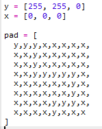

## Teken een pad

Laten we eerst het pad tekenen dat het personage moet volgen.

+ Open de Koorddansen start Trinket: <a href="https://trinket.io/python/9a587473cd" target="_blank">trinket.io/python/9a587473cd</a>.
    
    **De code voor het instellen van de Sense HAT is voor je meegeleverd.**

+ Laten we beginnen met het maken van variabelen om de kleuren die je wilt gebruiken op te slaan. Vergeet niet dat om de kleur van een individuele LED in te stellen, je moet zeggen hoeveel rood, groen en blauw het zou moeten hebben.
    
    Om geel te maken, heb je maximaal rood en groen nodig, en geen blauw:
    
    
    
    (Als je wilt, kun je naar [jumpto.cc/color](http://jumpto.cc/colours) gaan en elke gewenste kleur kiezen!

+ Je hebt ook zwarte pixels (of elke gewenste kleur) rond het pad nodig.
    
    

+ Om je pad te tekenen moet je eerst een lijst maken met de kleur van elke pixel.
    
    
    
    **Om typen te besparen, kun je de code van `snippets.py` in je project kopiëren.**
    
    

+ Vervolgens moet je `set_pixels` aanroepen om de afbeelding van je pad op de Sense HAT weer te geven.
    
    

+ Klik op 'Run' om je code te testen. Je zou een gele pixel moeten zien op de plaatsen waar je je `y` variabele hebt gebruikt, en geen kleur op de plaatsen waar je `x` hebt gebruikt.
    
    