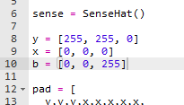
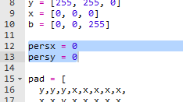
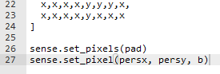

## Teken je speler

Laten we het personage aan je spel toevoegen.

+ Maak eerst een andere kleurvariabele voor je personage. Dit is hoe je blauw kunt maken:
    
    

+ Nu moet je variabelen maken om de x- en y-positie van je personage op te slaan. Om te beginnen stellen we deze beide in op `0`, dat is linksboven in de Sense HAT.
    
    

+ Om je personage weer te geven, gebruik `set_pixel`. Je moet `set_pixel` de x en y positie van de pixel vertellen, evenals de kleur.
    
    

+ Test je code, en je zou nu je personage linksboven in het scherm moeten zien.
    
    