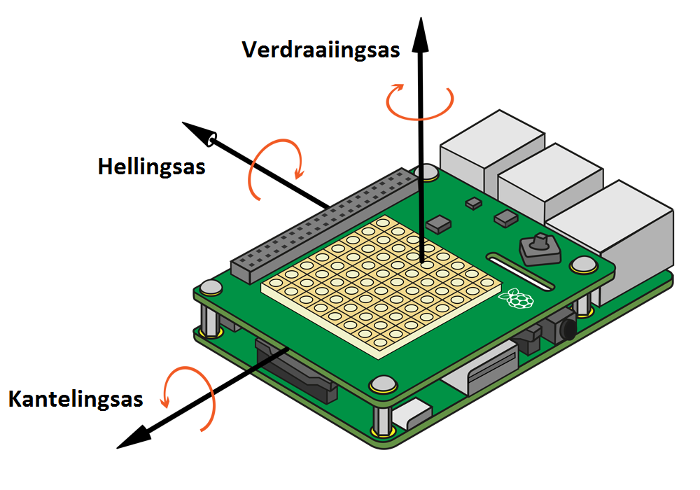
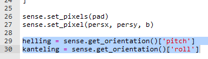
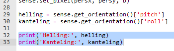
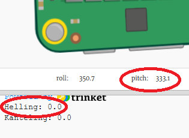
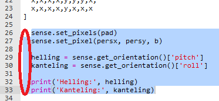
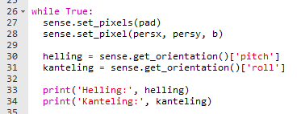
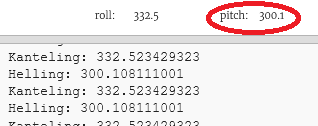

## Kanteling, helling en verdraaiing

Je gaat de Sense HAT kantelen om je personage te verplaatsen. Laten we beginnen met de **oriëntatie** (de positie) van je Sense HAT.

+ De Sense HAT kan zijn **kanteling (roll)**, **helling (pitch)** en **verdraaiing (yaw)** detecteren.
    
    

+ Probeer de Sense HAT te slepen om de waarden van de kanteling, de helling en de verdraaiing te veranderen om te zien hoe het beweegt.
    
    
    
    **Druk op de resetknop om de Sense HAT terug te zetten naar de uitgangspositie als je klaar bent met testen.**

+ We hebben alleen de helling en de kanteling nodig voor dit project, dus voeg 2 regels code toe om deze waarden uit de Sense HAT te halen.
    
    

+ Druk de helling en kanteling af om ze uit te testen.
    
    

+ Voer je code uit om het te testen en verander de helling van de Sense HAT door hem naar rechts te kantelen. Je ziet dat de afgedrukte `helling` waarde niet verandert!
    
    

+ Het probleem is dat je de `helling` en `kanteling` maar **één keer** krijgt en afdrukt.
    
    Om dit herhaaldelijk te doen, moet je eerst al je code om de pixels in te stellen inspringen, evenals het krijgen en printen van de `helling` en `kanteling` waarden.
    
    

+ Je kunt vervolgens `while True:` boven de ingesprongen code toevoegen om het voor altijd uit te voeren.
    
    

+ Test je code opnieuw, en deze keer zou je de afgedrukte waarde van `helling` moeten zien veranderen.
    
    