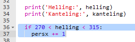
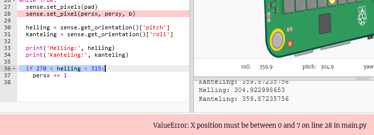
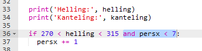
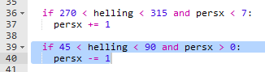
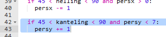
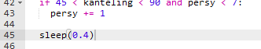

## Het personage verplaatsen

Laten we nu je personage verplaatsen wanneer de Sense HAT wordt gekanteld.

+ Laten we je personage naar rechts verplaatsen als de `helling` van de Sense HAT tussen `270` en `315` graden is.
    
    

+ Voeg deze code toe om de x-positie van het personage te wijzigen als de helling tussen `270` en `315` is:
    
    
    
    **Zorg ervoor dat deze code is ingesprongen, zodat het personage zich herhaaldelijk beweegt als de Sense HAT wordt gekanteld.**

+ Kantel je Sense HAT zodat de `helling` ligt tussen `270` en `315` graden. Je zou moeten zien dat je personage naar rechts beweegt, maar steeds van het scherm verdwijnt!
    
    
    
    Je zult ook een fout zien, omdat de x-positie van het karakter boven de 7 komt, wat geen geldige positie op het scherm is.
    
    

+ Om dit op te lossen, wil je je personage alleen naar rechts verplaatsen als de huidige positie kleiner is dan 7.
    
    

+ Test je verbeterde code, en je zou nu moeten zien dat je personage beweegt **totdat het aan de rechterkant van het scherm komt**.
    
    

+ We willen je personage ook naar links verplaatsen als de `helling` tussen `45` en `90` graden is.
    
    

+ Voeg deze code toe om je personage naar links te verplaatsen als de `helling` tussen `45` en `90` is, maar **alleen als het personage nog niet aan de linkerkant van het scherm** is.
    
    

+ Test je code om er zeker van te zijn dat je je personage naar links kunt kantelen.

+ Laten we vervolgens code toevoegen om de **y-positie** van je personage te veranderen: naar beneden bewegen als de waarde van **`kanteling`** tussen `45` en `90` is.
    
    

+ Test deze code om te zien of je de Sense HAT kunt kantelen om je personage omlaag te bewegen.
    
    

+ Als je je spel wilt vertragen, kan je korte `sleep` toevoegen aan het einde van je `while True:` lus.
    
    