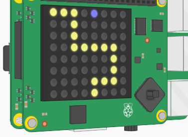
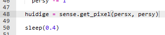
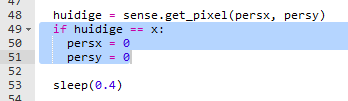

## Terug naar het begin

Laten we je personage terug naar het begin zetten als het van het pad valt.

+ Het is je misschien opgevallen dat er niets gebeurt als het personage van het pad valt.
    
    

+ Om dit op te lossen, sturen we het personage terug naar het begin als ze op een zwarte pixel staan.
    
    Laten we beginnen met het bepalen van de kleur van de pixel waarnaar het personage is verplaatst.
    
    

+ Als de kleur van de huidige pixel zwart is, stuur het personage dan terug naar het begin.
    
    

+ Test je code en je zou moeten zien dat je personage teruggaat naar het begin als ze van het pad vallen.