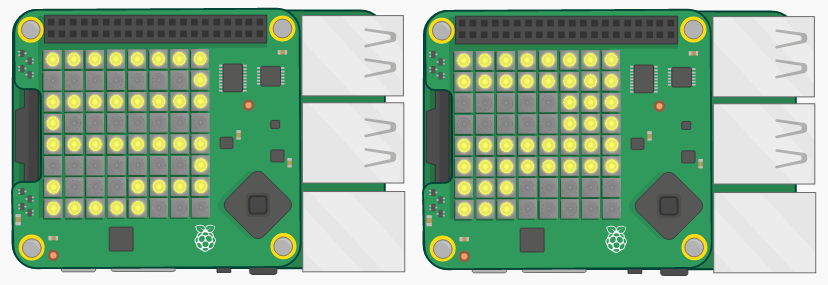

--- challenge ---

## Uitdaging: de moeilijkheidsgraad veranderen

Vraag een paar vrienden om je spel te testen. Vonden ze het te gemakkelijk of te moeilijk? Zo ja, dan kun je enkele wijzigingen aanbrengen:

+ Verander het pad dat het personage moet volgen;
+ Wijzig de `helling` en `kanteling` waarden die je personage verplaatsen;
+ Voeg een korte of langere `sleep` toe aan het einde van je lus.

--- /challenge ---

***
Dit project werd vertaald door vrijwilligers:

Robert-Jan Kempenaar

Sanneke van der Meer

Dankzij vrijwilligers kunnen we mensen over de hele wereld de kans geven om in hun eigen taal te leren. Jij kunt ons helpen meer mensen te bereiken door vrijwillig te starten met vertalen - meer informatie op [rpf.io/translate](https://rpf.io/translate).