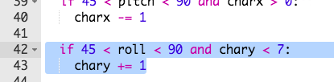

## Moving the character

Now let's move your character when the Sense HAT is tilted.

+ Let's move your character to the right if the Sense HAT's `pitch` is between `270` and `315` degrees.
    
    

+ Add this code to change the character's x position if the pitch is between `270` and `315`:
    
    
    
    **Make sure that this code is indented, so that the character moves repeatedly if the Sense HAT is tilted.**

+ Tilt your Sense HAT so that the `pitch` is between `270` and `315` degrees. You should see that your character moves to the right, but keeps going off the display!
    
    
    
    You will also see an error, because the character's x position goes above 7, which is not a valid position on the display.
    
    

+ To fix this, you only want to move your character to the right if its current position is less than 7.
    
    

+ Test your improved code, and you should now see that your character moves **until it gets to the right side of the display**.
    
    

+ We also want to move your character to the left when the `pitch` is between `45` and `90` degrees.
    
    

+ Add this code to move your character to the left if the `pitch` is between `45` and `90`, but **only if the character isn't already at the far left of the display**.
    
    

+ Test your code to make sure that you can tilt your character back to the left.

+ Next, let's add code to change your character's **y-position**, moving it down when the **`roll`** value is between `45` and `90`.
    
    

+ test this code to see if you can tilt the Sense HAT to move your character down.
    
    

+ If you want to slow your game down, you can add short `sleep` at the end of your `while True:` loop.
    
    