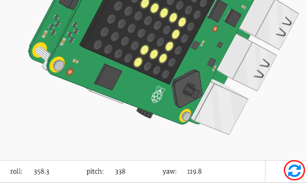

## Roll, pitch and yaw

You'll be tilting the Sense HAT to move your character. Let's start by finding out the **orientation** (the position) of your Sense HAT.

+ The Sense HAT can detect its **roll**, **pitch** and **yaw**.
    
    

+ Try dragging the Sense HAT to change its roll, pitch and yaw values to see how it moves.
    
    
    
    **Press the reset button to put the Sense HAT back to the starting position when you've finished testing.**

+ We only need the pitch and the roll for this project, so add 2 lines of code to get these values from the Sense HAT.
    
    

+ Print the pitch and roll to test them out.
    
    

+ Run your code to test it, and change the pitch of the Sense HAT to tilt it to the right. You'll notice that the printed `pitch` value doesn't change!
    
    

+ The problem is that you are only getting and printing the `pitch` and `roll` **once**.
    
    To do this repeatedly, you'll first need to indent all of your code for setting the pixels, as well as getting and printing the `pitch` and `roll` values.
    
    

+ You can then add `while True:` above the indented code to run it forever.
    
    

+ Test your code again, and this time you should see the printed `pitch` value change.
    
    